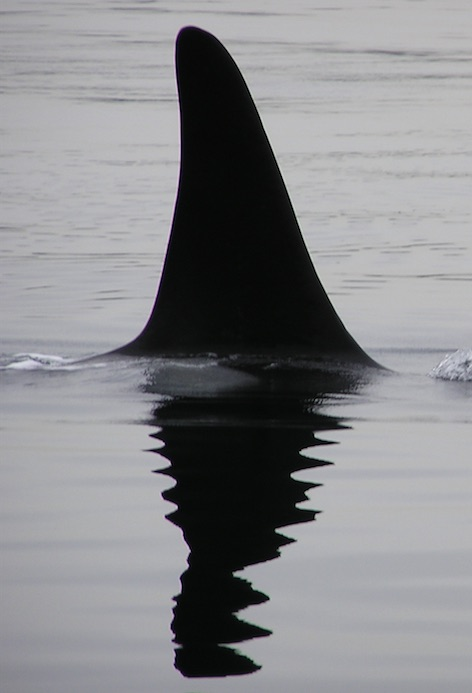

# OrcaHello SRKW Detector V1

Southern Resident Killer Whale (SRKW) call detection model.




## Model Description

This model detects the presence of Southern Resident Killer Whale (SRKW) calls in audio recordings from hydrophone networks. It was trained on labeled audio data from the Orcasound hydrophone network in Puget Sound, Washington.

**Architecture**: ResNet50 with custom classification head
**Input**: Mel spectrogram (1 channel, 256 mel bins, 312 time frames)
**Output**: Binary classification (orca call present / not present)
**Framework**: PyTorch (ported from FastAI)

### Model Details

- **Developed by**: Akash Mahajan, Prakruti Gogia, Aayush Agrawal
- **Model type**: Audio classification (binary)
- **License**: OrcaHello RAIL (Responsible AI License) - See LICENSE file
- **Finetuned from**: ResNet50 ImageNet pretrained weights
- **Date trained**: November 2020
- **Code**: [Orcasound/aifororcas-livesystem/InferenceSystem](https://github.com/orcasound/aifororcas-livesystem/tree/main/InferenceSystem)

**Note**: This is a port of the original FastAI model to pure PyTorch for easier usage and deployment.


## Usage

Use code within repository: [Orcasound/aifororcas-livesystem/InferenceSystem/](https://github.com/orcasound/aifororcas-livesystem/tree/main/InferenceSystem) after following setup.

### Quick Start: Detection in audio file

Internally handles audio pre-processing into segments and batched inference.

```python
from src.model_v1 import OrcaHelloSRKWDetectorV1

model = OrcaHelloSRKWDetectorV1.from_pretrained("orcasound/orcahello-srkw-detector-v1")
result = model.detect_srkw_from_file("audio.wav")

print(f"Orca detected: {result.global_prediction}")
print(f"Confidence: {result.global_confidence:.1f}%")
print(f"Segment predictions: {result.segment_predictions}")
```

### Advanced: Per-segment processing

For fine-grained control over audio preprocessing and per-segment predictions.

```python
from src.model_v1 import OrcaHelloSRKWDetectorV1, DetectorInferenceConfig
from src.model_v1.audio_frontend import AudioPreprocessor

# Load configuration
config = DetectorInferenceConfig.from_yaml("config.yaml")
model = OrcaHelloSRKWDetectorV1.from_pretrained("orcasound/orcahello-srkw-detector-v1")

# Process segments manually
preprocessor = AudioPreprocessor(config)
for mel_spec, start_s, duration_s in preprocessor.process_segments("audio.wav"):
    X = mel_spec.unsqueeze(0).to(model.device)
    confidence = model.predict_call(X)
    print(f"Segment at {start_s:.1f}s: confidence={confidence:.3f}")
```

### Configuration

Configuration can be loaded from YAML to modify inference behavior:

**YAML format** (`config.yaml`):
```yaml
audio:
  downmix_mono: true
  resample_rate: 20000

spectrogram:
  sample_rate: 16000
  n_fft: 2560
  hop_length: 256
  mel_n_filters: 256
  mel_f_min: 0.0
  mel_f_max: 10000.0

inference:
  window_s: 2.0               # segment length
  window_hop_s: 1.0           # hop between segments
  max_batch_size: 8           # max segments to process at once in detect_srkw_from_file
  local_conf_threshold: 0.5
  global_pred_threshold: 3
  strict_segments: true       # if false, allow partial final segment
```


Refer to repository above for complete setup and configuration details.


## Technical Specifications

### Model Architecture

```
Single-channel input → (1, 256, 312) channel x frequency x time mel spectrogram
  ↓
ResNet50 backbone (3,4,6,3 Bottleneck blocks) → (2048, 8, 10) feature map
  ↓
AdaptiveConcatPool2d [max, avg] → 4096 features
  ↓
BatchNorm1d(4096) → Dropout(0.25) → Linear(512) → ReLU
  ↓
BatchNorm1d(512) → Dropout(0.5) → Linear(2)
  ↓
Softmax → [P(negative), P(positive)]
```

### Training Data

- **Source**: [Pod.Cast data archive](https://ai4orcas.net/portfolio/pod-cast-annotation-system/) from the Orcasound hydrophone network (Puget Sound, WA)
- **Positive examples**: Confirmed annotated SRKW call segments (~0.5-4.0 seconds)
- **Negative examples**: Background ocean noise, boats, other marine animal sounds from "in the wild" deployment
- **Preprocessing**: Audio → Mel spectrogram (20kHz audio, 256 mel filterbank)

#### Training Hyperparameters

- **Architecture**: ResNet50 (3,4,6,3 Bottleneck blocks)
- **Pooling**: AdaptiveConcatPool2d (concatenates max + average)
- **Head**: BN(4096) → Dropout(0.25) → Linear(512) → ReLU → BN(512) → Dropout(0.5) → Linear(2)
- **Data loading**: SpecAugment-style augmentation with frequency masking, annotated calls padded/cropped to fixed 4.0s windows (312 time frames)
- **Loss**: Cross-entropy
- **Framework**: FastAI (original training)


## Evaluation

### Testing Data & Metrics

TODO: WIP


## Citation

**BibTeX:**

```bibtex
@software{orcahello_srkw_detector_v1,
  author = {Akash Mahajan and Prakruti Gogia and Aayush Agrawal},
  title = {OrcaHello SRKW Detector V1},
  year = {2020},
  url = {https://huggingface.co/orcasound/orcahello-srkw-detector-v1},
  license = {OrcaHello-RAIL}
}
```


## License

This model is released under the **OrcaHello RAIL (Responsible AI License)**, which includes specific restrictions to promote conservation of endangered Southern Resident Killer Whales.

**Key restrictions**:
- Prohibits use in violation of Marine Mammal Protection Act
- Prohibits support for captive whale industry
- Requires adherence to "Be Whale Wise" guidelines

Refer to the included LICENSE file for complete terms.


## Notes

### Environmental Impact

This model supports conservation of the critically endangered Southern Resident Killer Whale population (currently ~75 individuals as of Jan 2026). As a component of OrcaHello’s live monitoring pipeline, it helps:
- Filter 24hr hydrophone audio down to likely SRKW-call candidates for review
- Enable **human-in-the-loop** confirmation by experts before sending alerts/notifications
- Support downstream mitigation actions (e.g., coordinated vessel slow-downs and pausing pile-driving) during confirmed whale presence
- Engage citizen scientists in conservation via notifications on the Orcasound live listening web-app

Learn more: https://ai4orcas.net/orcahello/

### Recommendations

- Calibrate confidence thresholds based on your specific deployment environment
- Use as part of a two-stage detection system with expert review (moderator validation) for reliable alerts
- Ensemble with fine-grained classification/captioning/analysis models for efficient processing of audio archives

### Bias, Risks, and Limitations

- **Training data bias**: Model trained primarily on Orcasound Lab hydrophone data from Puget Sound
- **Environmental specificity**: Performance may vary with different acoustic environments
- **False positives**: Background noise, boats, and other marine mammals may trigger false detections
- **Time sensitivity**: Model was trained to process fixed-length 4-second segments, shorter segments padded with zeros


## Contact

- **Project**: https://www.orcasound.net/
- **Repository**: https://github.com/orcasound/aifororcas-livesystem
- **Issues**: https://github.com/orcasound/aifororcas-livesystem/issues
