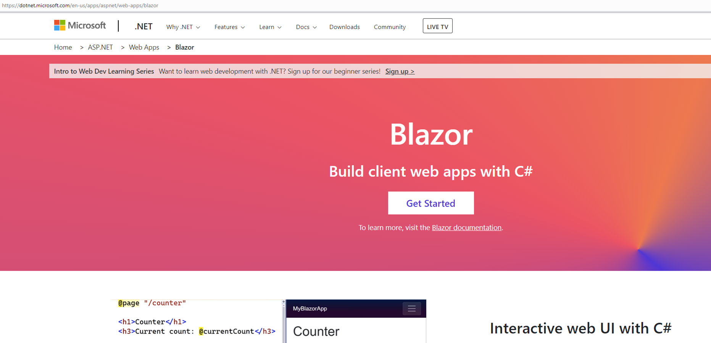
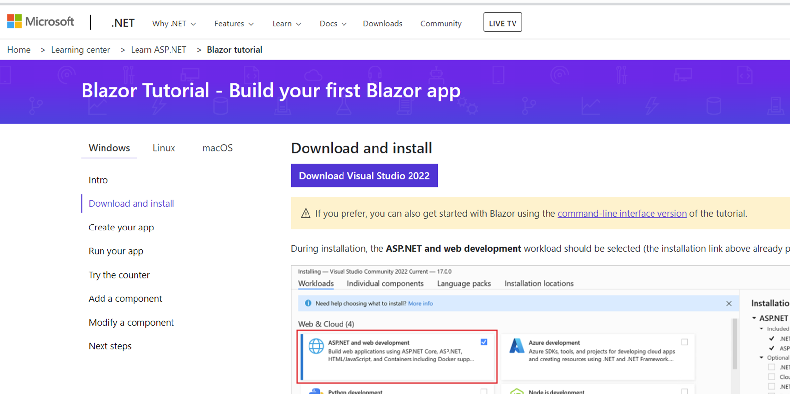

## Contributing
You can contribute by
1. Creating an issue to capture problems with the Moderator Portal and documentation [here](https://github.com/orcasound/aifororcas-livesystem/issues).
2. Forking the repo and generating a pull request to fix an issue with the code or documentation.
3. Joining the Orcasound open source organization on Github to edit the wiki and/or help review pull requests.

## Local Setup
You can get the ModeratorFrontEnd web client application running on your local machine by following the below steps:
1. The ModeratorFrontEnd is an ASP.NET Core Blazor Web App, so you need to intall the Visual Studio 2022 (as of this writing).
     
2. Select *Visual Studio ASP.NET and Web Development* workload with Visual Studio 2022 download.
    
3. Install the downloaded .exe for the setup with the workload selected.
4. Clone the forked repo to your local machine.
5. Check out the *main* branch.
6. Open the project as a solution in Visual Studio 2022 to make changes to the files/project.
7. Run locally by selecting the *AIForOrcas.Client.Web.csproj* and starting the application from Debug configuration from the toolbar.

