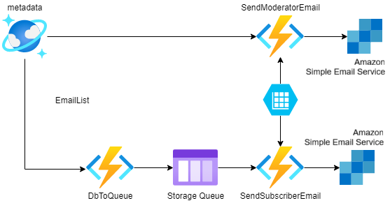

## AI For Orcas - Notification System

The notification system is a set of Azure functions responsible for:
- Facilitating adding/removing moderators and subscribers
- Identifying changes in the database and sending alerts

## Architecture

### Update Orcasite


One Azure Function is used to notify the [Orcasite JSON API](https://live.orcasound.net/api/json/swaggerui) of any machine detections.

- A change in the Cosmos DB metadata store triggers the PostToOrcasite function
- The Orcasite feeds API is used to map an OrcaHello location id to an Orcasite feed id
- The function then calls the Orcasite Detection API to post a detection to Orcasite

### Update email list


There are two Azure Functions that update the email list.

- ModeratorEmail is a REST API that writes to the email list
- SenderEmail is a REST API that writes to the email list
- Email list is implemented using Azure Tables, using either "Moderator" or "Subscriber" as the partition key

#### Sample REST calls

Add email to subscribers list:

```bash
curl -X POST -d '{"email": "sample@email.com"}' '<SubscriberEmailEndpoint>'
```

Delete email from subscribers list:

```bash
curl -X DELETE -d '{"email": "sample@email.com"}' '<SubscriberEmailEndpoint>'
```

Add email to moderators list:

```bash
curl -X POST -d '{"email": "sample@email.com"}' '<ModeratorEmailEndpoint>'
```

Delete email from moderators list:

```bash
curl -X DELETE -d '{"email": "sample@email.com"}' '<ModeratorEmailEndpoint>'
```

### Send email to moderators and subscribers



There are three other Azure Functions that make up the email notification system.

In the moderators flow:

- A change in the Cosmos DB metadata store triggers the SendModeratorEmail function
- If there is a newly detected orca call that requires a moderator to validate, the function fetches the relevant email list
- The function then calls AWS Simple Email Service to send emails to moderators

In the subscribers flow:

- A change in the Cosmos DB metadata store triggers the DbToQueue function
- If there is a new orca call that the moderator has validated, the function sends a message to a queue
- The SendSubscriberEmail function periodically checks the queue
- If there are items in the queue, the function fetches the relevant email list
- The function then calls AWS Simple Email Service to send emails to subscribers

## Get email list


There are two Azure Functions that query the email list.

- ListModeratorEmails is a REST API that lists all saved moderator emails
- ListSubscriberEmails is a REST API that lists all saved subscriber emails

### Sample REST calls

List all subscriber emails:

```bash
curl -X GET '<SubscriberEmailEndpoint>'
```

List all moderator emails:

```bash
curl -X GET '<ModeratorEmailEndpoint>'
```

## Prerequisites

- Access to the Orca Conservancy Azure subscription
- Install the [.NET Core 3.1 SDK](https://dotnet.microsoft.com/download/dotnet-core/3.1)
- Azure Function Tools
    - If using Visual Studio, include "Azure development" workload in installation
    - If using Visual Studio Code, add the "Azure Functions" extension
    - If using CLI, install the [Azure Functions Core Tools](https://docs.microsoft.com/en-us/azure/azure-functions/functions-run-local?tabs=linux%2Ccsharp%2Cbash#v2)
- If running locally - [Azure storage emulator](https://docs.microsoft.com/en-us/azure/storage/common/storage-use-emulator)

## Build 
To build the functions locally:

1. Go to /NotificationSystem directory (if not already)
2. If building from the command line, run 
    ```
    dotnet build NotificationSystem.csproj
    ```
3. If building from visual studio, simply open .csproj and build as normal

## Azure Resource Dependencies
All resources are located in resource group **LiveSRKWNotificationSystem**.

1. Storage account with queues, email template images and moderator/subscriber list: orcanotificationstorage
2. Metadata store (from which some functions are triggered): aifororcasmetadatastore
3. Azure function app: orcanotification

## Run Locally
It is recommended to go to the "orcanotification" function app, then Settings > Configuration to find the app settings used. 

Create local.settings.json in the current directory (NotificationSystem) using the below template. Fill in with valid configuration strings.

```json
{
    "IsEncrypted": false,
    "Values": {
        "AzureWebJobsStorage": "UseDevelopmentStorage=true",
        "FUNCTIONS_WORKER_RUNTIME": "dotnet",

        "OrcaNotificationStorageSetting": "<storage account connection string>",
        "aifororcasmetadatastore_DOCUMENTDB": "<cosmos db connection string>",
        "AWS_ACCESS_KEY_ID": "<AWS Access Key>",
        "AWS_SECRET_ACCESS_KEY": "<AWS Secret Key>",
        "SenderEmail": "<email address>",
        "FUNCTIONS_WORKER_RUNTIME": "dotnet",
        "FUNCTIONS_INPROC_NET8_ENABLED": "1"
    }
}
```

## Run on Azure

1. Go to the "orcanotification" function app (link 3 above). 
2. On the "Overview" tab, make sure the status of the function shows running.
3. On the "Functions" tab, you should see all the functions of the notification system. Enable/Disable as needed.

## Directory structure

The directories in this system are organized as follows:

* img: Contains images used in this README
* NotificationSystem: Contains the source code for the Azure functions
* NotificationSystem.Tests.Unit: Contains unit tests
* NotificationSystem.Tests.Integration: Contains integration tests
* PostBackfillToOrcasite: Contains a console app to post the history of machine detections to the Orcasite detection API
* TestData: Contains data files used by the tests
