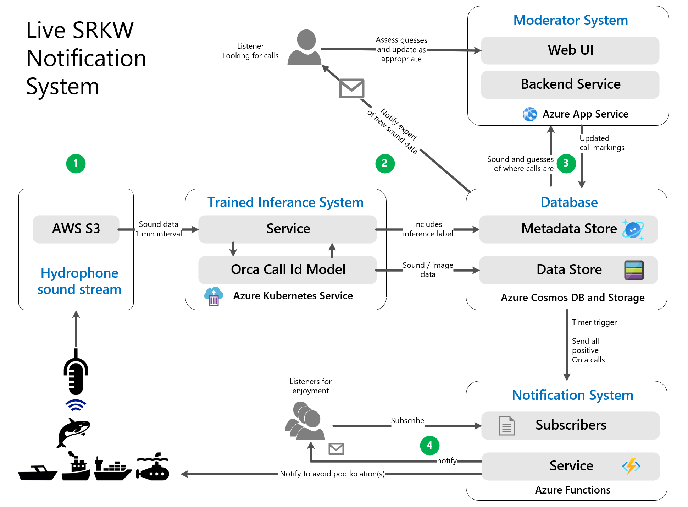

# OrcaHello: A real-time AI-assisted killer whale notification system 🎱 🐋

[Orcasound](https://www.orcasound.net/) has set up a hydrophone network in the Puget Sound. Killer whales sometimes swim by these hydrophones and vocalize in the form of calls.

We trained a deep learning model to find these calls in hydrophone audio. Each overlapping 2 second sub-segment is classified as whale call/ no-whale call.
Shown below is a 1-minute segment of hydrophone audio visualized as a spectrogram with whale calls detected by the model.

When whale-activity is detected by the model, it sends an email to our Moderators who are killer whale experts. 

Once they receive this email, they can visit the [Moderator Portal](https://aifororcas.azurewebsites.net/) shown below to confirm or reject model detections.

Most importantly, they tag detections with information if the whale call was emitted by a Southern Resident Killer Whale (SRKW) - an endangered ecotype found in the Puget Sound. If a SRKW is confirmed, an email is sent to subscribers.

This repository contains the implementations for the following  components that make up OrcaHello.
- [ModeratorFrontEnd](ModeratorFrontEnd) - Frontend code for the [Moderator Portal](https://aifororcas.azurewebsites.net/).
- [NotificationSystem](NotificationSystem) - Code to trigger email notifications.
- [InferenceSystem](InferenceSystem) - Code to perform inference with the trained model.
- [ModelTraining](ModelTraining) - Data preparation and model training.
- [ModelEvaluation](ModelEvaluation) - Benchmarking trained models on test sets.

## System overview
The diagram below describes the flow of data through OrcaHello and the technologies used.

## Contributing
You can contribute by
1. Creating an issue to capture problems with the Moderator Portal and documentation [here](https://github.com/orcasound/aifororcas-livesystem/issues).
2. Create a pull request to fix an issue or add documentation.

To contribute a pull request for a specific subsystem, please read the corresponding contributing guidelines and READMEs. 

- ModeratorFrontEnd | [README](ModeratorFrontEnd/README.md)  | [Contributing Guidelines](ModeratorFrontEnd/CONTRIBUTING.md)
- NotificationSystem | [README](NotificationSystem/README.md) | [Contributing Guidelines](NotificationSystem/CONTRIBUTING.md)
- InferenceSystem | [README](InferenceSystem/README.md) | [Contributing Guidelines](InferenceSystem/CONTRIBUTING.md)
- ModelTraining | [README](ModelTraining/README.md) | [Contributing Guidelines](ModelTraining/CONTRIBUTING.md)

## General Resources
[Project Page](https://ai4orcas.net/portfolio/orcahello-live-inference-system/) - contains information about the system and a brief history of the project.

## Related Projects
- [aifororcas-podcast](https://github.com/orcasound/aifororcas-podcast) - A tool to crowdsource labeling of whale calls in Orcasound's hydrophone data.
- [aifororcas-orcaml](https://github.com/orcasound/aifororcas-orcaml) - Original baseline machine learning model and data preparation code.
