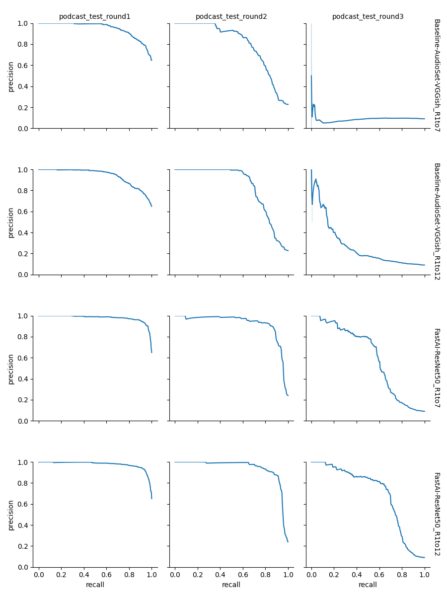

# Model Evaluation

The following process is used to score different models on Orcasound test sets. 

We use the [AU-PRC](https://machinelearningmastery.com/roc-curves-and-precision-recall-curves-for-classification-in-python/) metric - details are described in [Methodology](#Methodology). 

## Steps

1. Get test data with `download_datasets.py` from the [orcaml](https://github.com/orcasound/orcaml) repo by specifying the `--only_test` flag. (For details about the test sets see [Orcasound data wiki](https://github.com/orcasound/orcadata/wiki/Pod.Cast-data-archive#test-sets)) 
2. Run inference with your model and create a submission file following [Submission Format](#Submission-Format)
3. Run `score.py` to get the results, as well as detailed Precision-Recall curves 
4. You can score multiple submission files together, to easily compare different models


## Submission Format 

Your submission should contain a series of time-intervals, with associated confidence scores for each `wav_filename` in the test set. 

The intervals can have any duration, but should be non-overlapping and together cover the entire wav file. If any time intervals are unmarked, they are assumed to be zero confidence. 

> Times do not need to be too accurate: they are quantized to 1-second level precision. NOTE: *you should not apply any thresholding - this is part of the scorer.*

Specifically, we need a tsv with these columns:

- **wav_filename** - namesake 
- **start_time_s** - specified relative to the audio file (in sec) 
- **duration_s** - duration of the interval (in sec) 
- **confidence** - confidence score, which is used to generate the AU-PRC metrics and curve 

For an example, see `submission/AudioSet-VGGish-R1to7.tsv`. 

## Methodology

We quantize intervals from both the ground truth and the submission file into 1 second time windows. 

> If N:N+1 seconds contains a part of the interval, N is counted. 

These quantized intervals are then treated as individual examples for generating the [AU-PRC](https://machinelearningmastery.com/roc-curves-and-precision-recall-curves-for-classification-in-python/) as the evaluation metric. 

The AU-PRC is computed individually for each sub-dataset and a simple average is taken for the `OVERALL` score. 

## Example

This runs scoring for the baseline, and the current best model.

```bash
python score.py -testSetDir [DOWNLOAD_DATASETS] -submissionFiles "submission\Baseline-AudioSet-VGGish_R1to7.tsv,submission\FastAI-ResNet50_R1to7.tsv" -threshold (OPTIONAL)
```

A `results.md` file containing a summary, `au_pr_curves.png` containing plots and `metrics.tsv` containing details is written to the directory containing the submission files. 

If the optional `-threshold` argument, is provided, precision/recall/F1 scores are also included in `metrics.tsv`. 
*(Note: this is only for development purposes, the official metric is threshold-independent AUPRC)*

## Results

This the the current state-of-art for models on the repo :) 

| dataset             |   [Baseline-AudioSet-VGGish_R1to7](https://microsoft.sharepoint.com/:u:/t/OrcaCallAutomatedRecognitionSystemHackathon2019Project/EWGJMz-YuRxNhn9US9h-3Y4B6HYJGQk8yjs_YNXpvtD4jg?e=GXKOX0) |   [FastAI-ResNet50_R1to7](https://microsoft.sharepoint.com/:u:/t/OrcaCallAutomatedRecognitionSystemHackathon2019Project/EYcGElFToGpHnFDI41iO5e8B2vu_GLTZP6aVhx3GII5sew?e=vd7FCl) |
|:--------------------|---------------------------------:|------------------------:|
| OVERALL             |                            0.614 |                   0.836 |
| podcast_test_round1 |                            0.949 |                   0.979 |
| podcast_test_round2 |                            0.803 |                   0.923 |
| podcast_test_round3 |                            0.09  |                   0.605 |



> **NOTE:** If you are deploying a new model (1) generate your submission file and score, comparing with existing files (2) update `/submission` and this README with your results (3) Upload your model (with similar naming convention) to [folder](https://microsoft.sharepoint.com/:f:/t/OrcaCallAutomatedRecognitionSystemHackathon2019Project/ElW2pjtFsndMiE4C80kKuMMB_SqFbdDbWGl3WYN59UA31Q?e=o1NgAr) and update links in the README.
